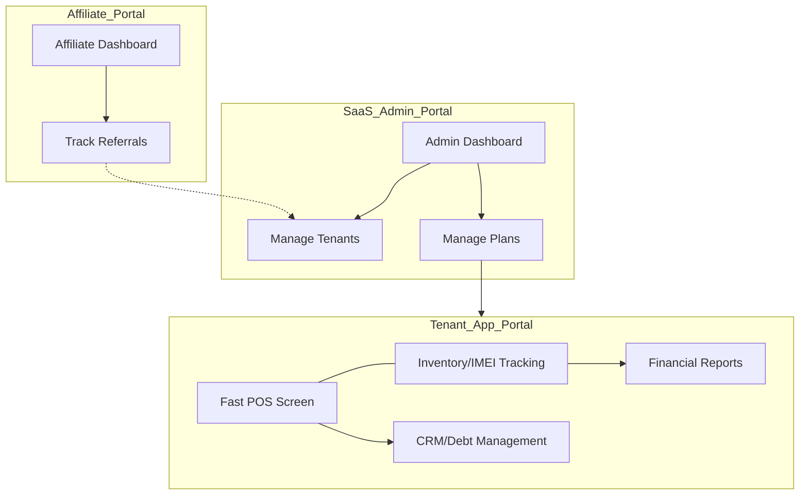

# 07 هيكل المعلومات وخريطة الموقع (UX IA & Sitemap)
**مشروع Ebraa ERP - التنظيم الهيكلي للواجهات**
*النسخة v1.1 - تصميم مخصص لـ PWA و Inertia v3*

---

## 1. فلسفة هيكلة المعلومات (UX Philosophy)
يعتمد النظام على **معمارية هجينة (Hybrid Architecture)** تجمع بين سرعة التطبيقات المكتبية (Desktop) ومرونة السحاب (SaaS). تم تصميم الهيكل لتقليل "التفكير" (Cognitive Load) عبر:
- **التجميع الوظيفي:** وضع الأدوات التي يحتاجها المستخدم في سياق واحد (مثلاً: البيع السريع + المرتجع في شاشة واحدة).
- **الوصول المسطح (Flat Navigation):** لا تتجاوز أي صفحة 3 نقرات من الصفحة الرئيسية.
- **الفصل التام للهويات:** 3 بوابات منفصلة بألوان وهياكل مختلفة لمنع التشتت.

---

## 2. خريطة الموقع (Sitemap) — 18 صفحة أساسية

### 🏢 أولاً: بوابة المحل (Tenant/Merchant Portal) — `/app`
*الهدف: السرعة القصوى في الإدخال والبيع.*

1.  **لوحة التحكم (Dashboard):** ملخص مبيعات اليوم، تنبيهات السيريالات المنتهية، ديون العملاء.
2.  **نقطة البيع (POS Screen):** (الصفحة الأهم) بيع بالـ IMEI، طباعة صامتة، سلة مشتريات سريعة.
3.  **المخزن الذكي (Inventory):** قائمة المنتجات، حالات السيريال (Available/Sold/Repair).
4.  **إضافة مخزون (Inventory In):** استلام بضاعة جديدة بالسيريالات (Barcode Scanning Focus).
5.  **الجرد السريع (Stock Take):** واجهة مخصصة للمسح السريع ومقارنة الفروقات.
6.  **المرتجعات (Returns):** البحث برقم الفاتورة أو السيريال لإتمام المرتجع.
7.  **العملاء والديون (CRM):** سجل العملاء، متابعة المبالغ الآجلة، تاريخ المشتريات.
8.  **الخزينة (Finance):** حركة النقدية اليومية، إغلاق الوردية (End of Shift).
9.  **التقارير (Reports):** تقرير الأرباح، تقرير حركة صنف، تقارير أداء البائعين.
10. **الإعدادات (Settings):** إعدادات الطابعة الحرارية، صلاحيات الموظفين، تفاصيل الفرع.

### 🤝 ثانياً: بوابة المسوقين (Affiliate Portal) — `/affiliate`
*الهدف: الشفافية والتحفيز على الإحالات.*

11. **الرئيسية (Overview):** إجمالي العمولات، الرابط الخاص بك (Unique Referral Link).
12. **سجل الإحالات (Referrals):** قائمة المحلات التي سجلت عن طريقك وحالة اشتراكاتهم.
13. **العمولات والسحب (Payouts):** رصيد العمولات المتاح، سجل التحويلات السابقة، طلب سحب.
14. **الملف الشخصي (Profile):** بيانات الدفع (InstaPay/Bank)، إعدادات التنبيهات.

### 🛡️ ثالثاً: لوحة تحكم SaaS Admin — `/admin`
*الهدف: السيطرة المركزية وإدارة النمو.*

15. **نظرة عامة (SaaS Dashboard):** إجمالي الإيرادات، عدد المشتركين النشطين، المحلات الجديدة.
16. **إدارة المحلات (Tenants):** تفعيل/تعطيل المحلات، تغيير الباقات يدوياً، تتبع الديون.
17. **إدارة الخطط والأسعار (Plans):** تعديل ميزات الباقات، تحديث الأسعار لمواجهة التضخم.
18. **الدعم الفني (Support):** سجل الشكاوى، إرسال تنبيهات عامة لكل المحلات.

---

## 3. شجرة التنقل (Navigation Tree)

### 🖥️ واجهة الويب والـ PWA
- **Side Sidebar:** (ثابت في سطح المكتب / منسدل في الموبايل) يحتوي على الأيقونات الرئيسية لسرعة التنقل.
- **تنبيهات تليجرام:** زر لربط الحساب واستقبال الإشعارات والتقارير.
- **Top Bar:** (ديناميكي) يحتوي على:
    - زر "بحث سريع عن سيريال" (Global Serial Search) متاح من أي مكان.
    - زر "فتح درج النقدية" (عبر الطابعة الحرارية).
    - أيقونة تثبيت الـ PWA (Install App).

---

## 4. تدرج المعلومات (Information Hierarchy)

| المستوى | العناصر | طريقة العرض |
|---|---|---|
| **Primary (حرج)** | السعر الإجمالي، زر الدفع، حقل إدخال IMEI | أكبر خط، ألوان بارزة، تركيز تلقائي (Auto-focus) |
| **Secondary (هام)** | اسم المنتج، حالة الضمان، تفاصيل العميل | خط متوسط، تباين جيد |
| **Tertiary (ثانوي)** | تاريخ الإضافة، المورد، SKU | خط صغير، رمادي، يظهر عند الطلب أو Hover |

---

## 5. الربط بين البوابات (Cross-Portal Architecture)

---

> [!TIP]
> تم تقليل عدد الصفحات إلى 18 صفحة لضمان أن يركز المطور المنفرد على **جودة التفاعل** بدلاً من كثرة الصفحات غير الضرورية.
