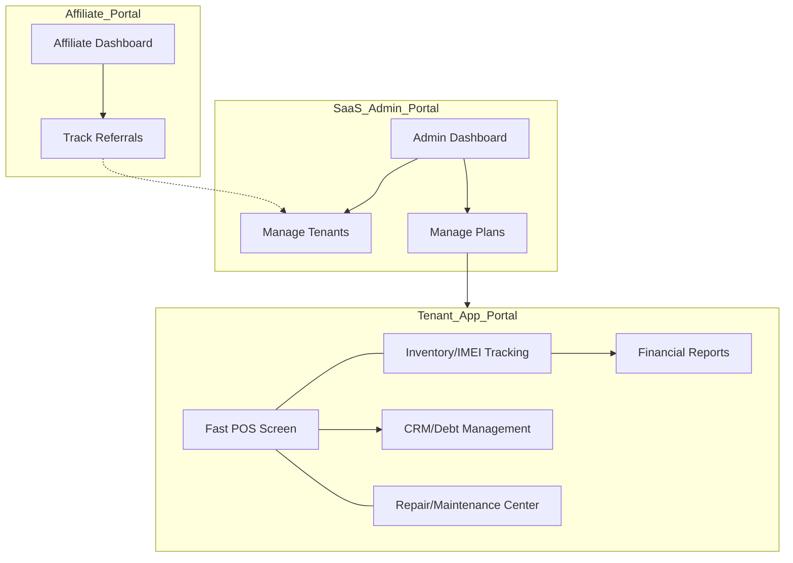

# 07 هيكل المعلومات وخريطة الموقع (UX IA & Sitemap)
**مشروع Ebraa ERP - التنظيم الهيكلي للواجهات**
*النسخة v1.1 - تصميم مخصص لـ PWA و Inertia v3*

---

## 1. فلسفة هيكلة المعلومات (UX Philosophy)
يعتمد النظام على **معمارية هجينة (Hybrid Architecture)** تجمع بين سرعة التطبيقات المكتبية (Desktop) ومرونة السحاب (SaaS). تم تصميم الهيكل لتقليل "التفكير" (Cognitive Load) عبر:
- **التجميع الوظيفي:** وضع الأدوات التي يحتاجها المستخدم في سياق واحد (مثلاً: البيع السريع + المرتجع في شاشة واحدة).
- **الوصول المسطح (Flat Navigation):** لا تتجاوز أي صفحة 3 نقرات من الصفحة الرئيسية.
- **الفصل التام للهويات:** 3 بوابات منفصلة بألوان وهياكل مختلفة لمنع التشتت.

---

## 2. خريطة الموقع (Sitemap) — الهيكل المبوب الجديد

### 🏢 أولاً: بوابة المنشأة (Tenant/Merchant Portal) — `/app`
*تعتمد على **Navbar** علوي و**Quick Access Tiles** في لوحة التحكم.*

1.  **لوحة التحكم (Dashboard):** واجهة "البلاطات" للوصول السريع + ملخص إحصائي لحظي.
2.  **البضاعة (Inventory):** (قائمة الأصناف، إدارة المخازن، التحويلات بين الفروع، الجرد السريع).
3.  **الفواتير (Invoicing):** (شاشة POS السريعة، فواتير المشتريات، مرتجعات المبيعات والمشتريات).
4.  **الحسابات (Accounting):** (دليل العملاء، دليل الموردين، كشوفات الحساب التفصيلية).
5.  **الخزينة (Treasury):** (حركة الخزينة مع مؤشر الرصيد، التحويلات البنكية، صرف وقبض).
6.  **الصيانة (Maintenance):** (فتح تذاكر صيانة، تتبع حالة الجهاز، استهلاك قطع غيار، تحويل لفاتورة).
7.  **التقارير (Reports):** (تحليل المبيعات المتقدم، حركة الصنف التفصيلية، تقارير الأرباح).
8.  **النظام (System Settings):** (بيانات الشركة، إدارة المستخدمين، مصفوفة الصلاحيات CRUD).

### 🤝 ثانياً: بوابة المسوقين (Affiliate Portal) — `/affiliate`
8.  **الرئيسية (Overview):** إجمالي العمولات، الرابط الخاص بك (Unique Referral Link).
9.  **سجل الإحالات (Referrals):** قائمة المنشآت التي سجلت عن طريقك وحالة اشتراكاتهم.
10. **العمولات والسحب (Payouts):** رصيد العمولات المتاح، سجل التحويلات السابقة، طلب سحب.

### 🛡️ ثالثاً: لوحة تحكم SaaS Admin — `/admin`
11. **نظرة عامة (SaaS Dashboard):** إجمالي الإيرادات، عدد المشتركين، نمو المنصة.
12. **إدارة المنشآت والاشتراكات:** تفعيل/تعطيل المنشآت، إدارة الخطط والأسعار (Plans).
13. **إدارة المسوقين:** مراجعة واعتماد العمولات وطلبات السحب.

---

## 3. شجرة التنقل (Navigation Tree)

### 🖥️ واجهة الويب والـ PWA
- **Side Sidebar:** (ثابت في سطح المكتب / منسدل في الموبايل) يحتوي على الأيقونات الرئيسية لسرعة التنقل.
- **تنبيهات تليجرام:** زر لربط الحساب واستقبال الإشعارات والتقارير.
- **Top Bar:** (ديناميكي) يحتوي على:
    - زر "بحث سريع عن سيريال" (Global Serial Search) متاح من أي مكان.
    - زر "فتح درج النقدية" (عبر الطابعة الحرارية).
    - أيقونة تثبيت الـ PWA (Install App).

---

## 4. تدرج المعلومات (Information Hierarchy)

| المستوى | العناصر | طريقة العرض |
|---|---|---|
| **Primary (حرج)** | السعر الإجمالي، زر الدفع، حقل إدخال IMEI | أكبر خط، ألوان بارزة، تركيز تلقائي (Auto-focus) |
| **Secondary (هام)** | اسم المنتج، حالة الضمان، تفاصيل العميل | خط متوسط، تباين جيد |
| **Tertiary (ثانوي)** | تاريخ الإضافة، المورد، SKU | خط صغير، رمادي، يظهر عند الطلب أو Hover |

---

## 5. الربط بين البوابات (Cross-Portal Architecture)

---

> [!TIP]
> تم تقليل عدد الصفحات إلى 18 صفحة لضمان أن يركز المطور المنفرد على **جودة التفاعل** بدلاً من كثرة الصفحات غير الضرورية.
