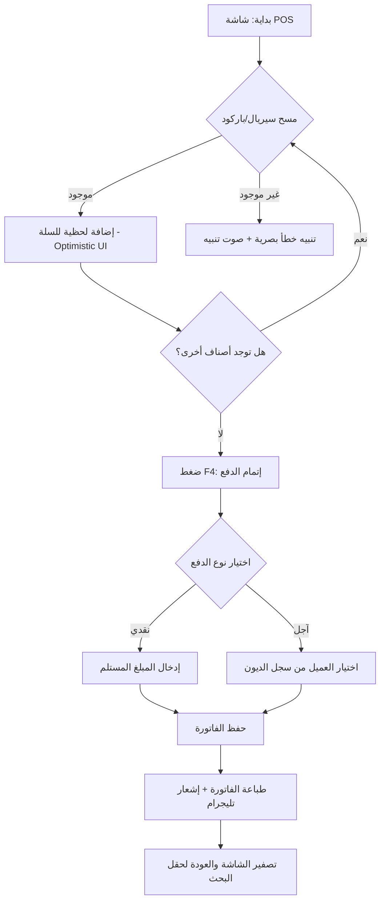
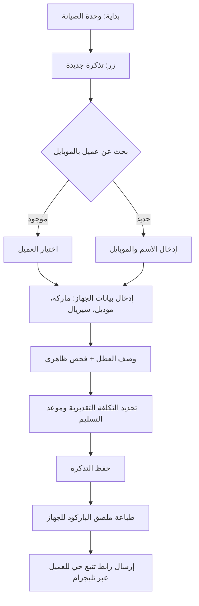

# 🚀 رحلات المستخدم (User Flows) - Ebraa ERP
**المنطق التفاعلي لمسارات العمل الأساسية v1.0**

---

## 1. المسار السعيد: عملية بيع بالسيريال (Core Happy Path)
*الهدف: إتمام البيع في أقل من 10 ثوانٍ.*

---

## 2. المسار الثانوي: فتح تذكرة صيانة (Repair Intake Path)
*الهدف: توثيق حالة الجهاز وتأمين حق التاجر.*

---
*ملاحظة تقنية: كافة الانتقالات بين الخطوات تتم عبر Inertia.js دون إعادة تحميل الصفحة لضمان تجربة Zero-Lag.*
